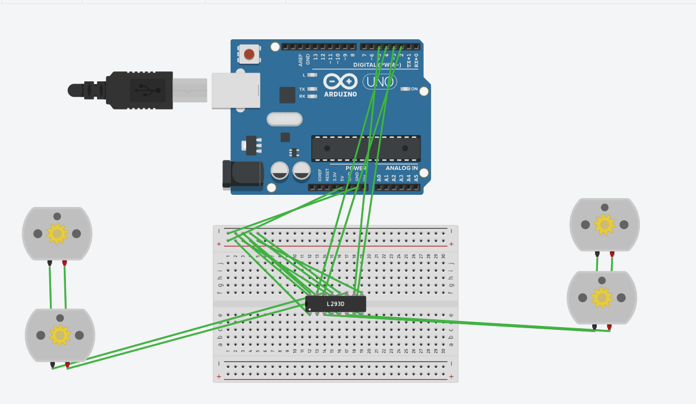
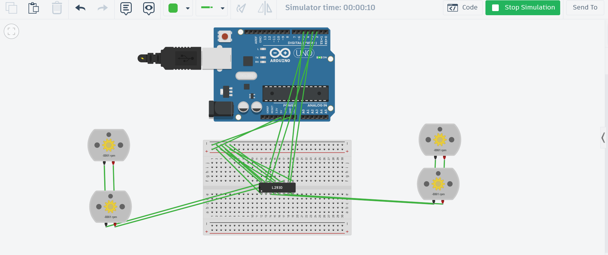
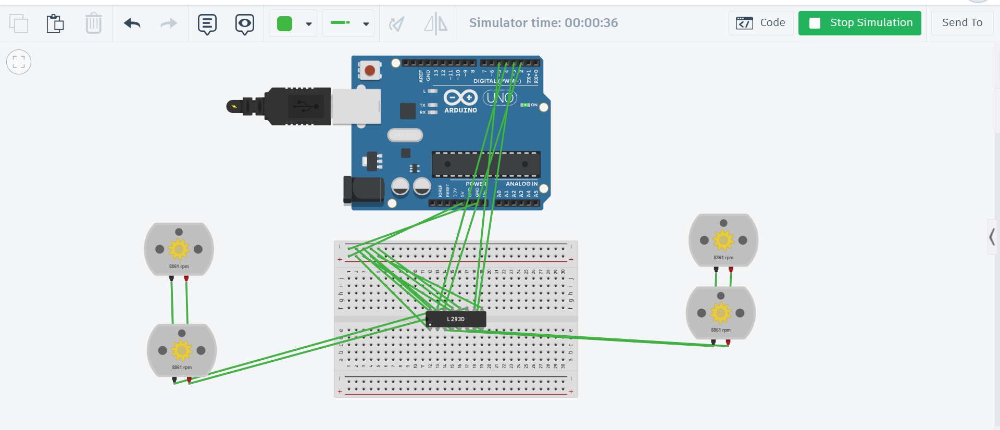
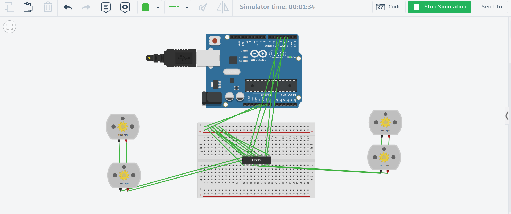
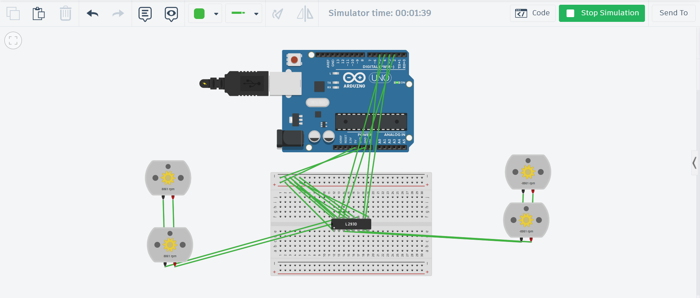

# 4WD Motor Sequence Control (L293D)

Arduino Uno simulation on Tinkercad controlling 4 DC motors using the L293D motor driver chip.

## Pin Out Configuration
* **IN1:** Pin 2
* **IN2:** Pin 3
* **IN3:** Pin 4
* **IN4:** Pin 5

## Timed Sequence Logic
1. **Forward:** All motors rotate forward for 30 seconds.
2. **Reverse:** All motors reverse direction for 60 seconds.
3. **Alternating Turn:** Motors alternate between turning Right and Left (5s intervals) for 60 seconds.

---

## Simulation Screenshots & Proof of Work

### Circuit Wiring Setup

### Phase 1: Forward Motion (0s - 30s)

### Phase 2: Reverse Motion (30s - 90s)

### Phase 3: Alternating Turns (90s - 150s)
* **Right Turn Phase:**

* **Left Turn Phase:**

---

## Repository Files
* `robot_control.ino` - Main Arduino C++ code.
* `README.md` - Documentation with screenshots.
